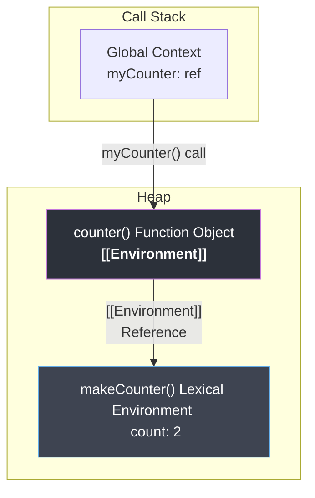

# `[[Environment]]` Reference & Closures

## Теза
Функції в JavaScript є об'єктами першого класу (First-class objects). При створенні кожна функція автоматично отримує приховане поле **`[[Environment]]`**, яке назавжди зберігає посилання на Лексичне Середовище (Lexical Environment), в якому вона була оголошена. Це і є внутрішнім механізмом роботи **Замикань (Closures)**.

## Приклад
```javascript
function makeCounter() {
  let count = 0; // Змінна в Lexical Environment батька
  
  return function counter() {
    return ++count; // Доступ до збереженого лексичного середовища
  }
}

const myCounter = makeCounter();
console.log(myCounter()); // 1
console.log(myCounter()); // 2
```

## Просте пояснення
Функція в JavaScript схожа на мандрівника, який при створенні пакує рюкзак. У цьому "рюкзаку" знаходяться всі змінні з місця, де вона народилася. Навіть якщо функцію експортують, передадуть як аргумент або повернуть з іншої функції, її "рюкзак" завжди подорожує разом з нею. 
Тому вкладена функція `counter` пам'ятає змінну `count`, хоча зовнішня функція `makeCounter` вже давно завершила свою роботу, а її виконання зникло з Call Stack.

## Технічне пояснення
За специфікацією ECMA-262, життєвий цикл замикання виглядає так:
1. **Створення (Creation):** Коли парсер V8 зустрічає оголошення функції (наприклад, `function counter`), він створює Function Object у пам'яті (Heap). Цьому об'єкту присвоюється прихована властивість `[[Environment]]`, яка вказує на поточний активний `LexicalEnvironment` (в даному випадку — Environment Record функції `makeCounter`).
2. **Повернення (Return):** Коли `makeCounter` завершує виконання, її Execution Context видаляється зі стеку (Stack Frame Popped). Але її Lexical Environment **не видаляється** з пам'яті (Heap), оскільки на нього тримає посилання властивість `[[Environment]]` внутрішньої функції `counter`.
3. **Виклик (Execution):** Коли ми викликаємо `myCounter()`, рушій створює новий Execution Context. Його `[[OuterEnv]]` (Outer Reference) встановлюється значенням, що зберігається в `[[Environment]]` функції. Тобто він прив'язується до старого Lexical Environment функції `makeCounter`.

> [!TIP]
> **V8 Optimization (Context Allocation):** V8 дуже розумний. На етапі компіляції (Ignition / TurboFan) рушій аналізує, які змінні реально використовуються внутрішніми функціями. Змінна `count` захоплюється замиканням і переміщується до контекстної Heap-пам'яті (Context Allocation). Будь-які інші змінні в `makeCounter`, які НЕ використовуються дочірніми функціями, залишаються на стеку і безслідно знищуються після завершення функції.

## Візуалізація


> [!TIP]
> **[▶ Запустити інтерактивний симулятор (Closures & Environment Reference)](../../visualisation/functions-and-oop/01-closures/index.html)**
> 
> *Цей візуалізатор ілюструє, як Stack Frame видаляється, а Lexical Environment продовжує жити в Heap.*

## Edge Cases / Підводні камені

### Memory Leaks (Витоки пам'яті)
Замикання — найпоширеніша причина витоків пам'яті в JS.
Якщо великий об'єкт прив'язаний у Event Listener або через `setInterval`, і він замикає на собі змінні з батьківської функції, Garbage Collector (GC) не зможе видалити батьківський Lexical Environment:
```javascript
function attachHandler() {
  const hugeData = new Array(1000000).fill('data');
  const element = document.getElementById('btn');
  
  element.addEventListener('click', function onClick() {
    // onClick утримує hugeData у своєму [[Environment]]
    console.log(hugeData.length);
  });
}
```
Якщо елемент `#btn` видалити з DOM, але не зробити `element.removeEventListener`, об'єкт `hugeData` назавжди зависне в пам'яті як "живе" замикання.
