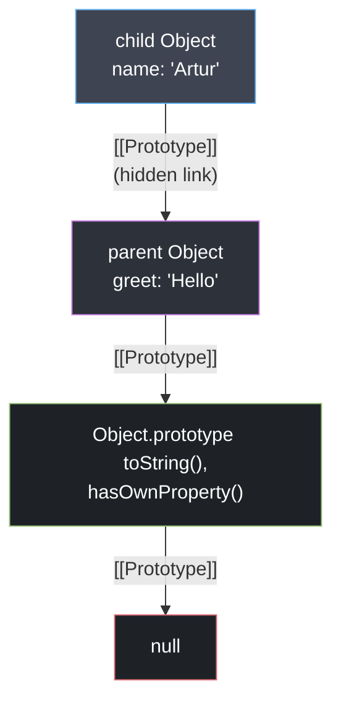

# Prototype Chain Lookup: How `[[Get]]` Works

## Теза
JavaScript використовує прототипне делегування (Prototypal Delegation) замість класичного успадкування класів. Кожен об'єкт має приховане посилання **`[[Prototype]]`**, яке під час читання властивості змушує рушій підійматися вгору по ланцюжку прототипів (Prototype Chain) доки не буде знайдено значення або не буде досягнуто `null`.

## Приклад
```javascript
const parent = { greet: 'Hello' };
const child = Object.create(parent);

console.log(child.greet); // 'Hello'
console.log(child.toString()); // [object Object] (знайдено з Object.prototype)
```

## Просте пояснення
Об'єкт у JS немов співробітник компанії. Коли ви просите його щось зробити (викликаєте властивість), він спочатку шукає відповідь у своєму власному блокноті (`hasOwnProperty`). 
Якщо в його блокноті цього немає, він не здається, а передає запит "керівнику" (своєму `[[Prototype]]`). Керівник перевіряє свій блокнот. Якщо немає — іде до директора (`Object.prototype`). Якщо навіть у директора немає інформації, тільки тоді повертається відповідь `undefined`. Цей ланцюжок запитів і називається Prototype Chain.

## Технічне пояснення
Згідно зі специфікацією ECMA-262, при спробі прочитати властивість об'єкта `O.P` (де `O` — об'єкт, а `P` — властивість), рушій V8 викликає внутрішній метод **`[[Get]](O, P, Receiver)`**:
1. Перевіряє, чи має `O` власну властивість `P` (через `GetOwnProperty`).
2. Якщо властивість знайдена та вона є звичайним значенням (Data Descriptor), повертається значення. Якщо це Getter (Accessor Descriptor), він викликається з поточним `Receiver` (значення `this`).
3. Якщо властивості немає, рушій отримує прототип об'єкта `parent = O.[[Prototype]]`.
4. Якщо `parent === null`, повертається `undefined`.
5. Інакше рушій рекурсивно викликає `parent.[[Get]](parent, P, Receiver)`.

> [!CAUTION]
> **Performance Hit (Dictionary Mode):** Коли ви читаєте властивості об'єкта, V8 намагається прискорити це через **Inline Caches (IC)** та передбачення типів на основі Hidden Classes (Shapes). Доступ по прототипу до `O.P` проходить по кешованих мапах (Transition Trees).
> АЛЕ, якщо ви змінюєте сам `[[Prototype]]` об'єкта під час роботи програми (через сумнозвісний `Object.setPrototypeOf()` або `obj.__proto__ = newProto`), V8 ламає **всі** оптимізації цього об'єкта. Він "деоптимізується" (De-opts) у повільний режим Dictionary Mode на все життя цієї гілки або додатку.

## Візуалізація


> [!TIP]
> **[▶ Запустити інтерактивний симулятор (Prototype Chain `[[Get]]` Lookup)](../../visualisation/functions-and-oop/02-prototype-chain/index.html)**
> 
> *Візуалізатор наочно показує, як внутрішня операція `[[Get]]` рекурсивно скролить ієрархію пам'яті (Heap) в пошуках властивостей.*

## Edge Cases / Підводні камені

### 1. Prototype Pollution & Безпечні Словники
Об'єкти, які створюються через `{}` завжди успадковують `Object.prototype`, і тому містять такі методи як `__proto__`, `toString`, `valueOf`.
Якщо ви використовуєте об'єкт як словник (Key-Value map) для користувацького вводу:
```javascript
const payload = JSON.parse('{"__proto__": {"admin": true}}');
// Якщо б ми зробили Object.assign({}, payload) - можна зламати прототип усіх об'єктів
```
**Рішення:** Завжди створюйте чистий об'єкт без прототипу: 
`const safeDict = Object.create(null)`. Він не має батька і не вразливий до `toString()` конфліктів.

### 2. Shadowing (Затінення властивостей)
Якщо і об'єкт, і його прототип мають одну й ту саму властивість (одне й те саме ім'я), властивість `P` знайдеться на кроці 1 операції `[[Get]]`. У цьому випадку значення прототипу ігнорується. Це називається **Property Shadowing**:
```javascript
const parentObj = { val: 10 };
const childObj = Object.create(parentObj);
childObj.val = 20; // Створюється НОВА властивість на самому childObj
console.log(parentObj.val); // 10 (прототип не змінився!)
```
