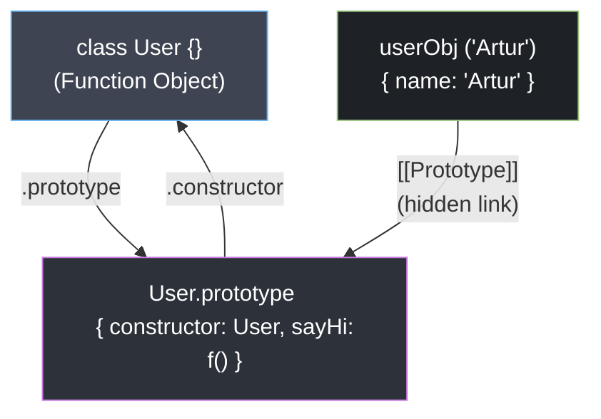

# Syntactic Sugar (`class` vs Constructor)

## Теза
Ключове слово `class`, введене в ES6, не створює нову об'єктно-орієнтовану модель на базі класів (як у Java, C# або Python). Під капотом це "синтаксичний цукор" (набір зручних обгорток) над класичними функціями-конструкторами та прототипним делегуванням. 

## Приклад
```javascript
// Сучасний ES6 Class
class User {
  constructor(name) { this.name = name; }
  sayHi() { console.log(this.name); }
}

// Абсолютно те саме на рівні ES5
function User(name) { this.name = name; }
User.prototype.sayHi = function() { console.log(this.name); }
```

## Просте пояснення
Мова JavaScript народилася всього за 10 днів і була побудована навколо прототипів. Коли світ зажадав "нормальних об'єктів" як в інших мовах програмування, творці JS не могли змінити внутрішню архітектуру (бо це зламало би половину сайтів в інтернеті). Тому вони вигадали нове слово `class`. Але коли код запускається, рушій "здирає цукрову обгортку" і працює зі старою, доброю функцією та її прототипом. Усі методи класу просто автоматично записуються в спільний `.prototype` словник, щоб усі екземпляри не копіювали їх до себе в пам'ять.

## Технічне пояснення
Згідно зі специфікацією ECMA-262, при виклику функції з ключовим словом **`new`** (чи це `new Function()`, чи `new Class()`), рушій V8 виконує операцію **`[[Construct]]`**, що розпадається на 4 етапи:
1. **Виділення пам'яті:** Створюється новий свіжий об'єкт `{}` в Heap.
2. **Делегація:** Створюється прихований зв'язок: внутрішньому посиланню `[[Prototype]]` нового об'єкта присвоюється значення властивості `Constructor.prototype` (наприклад, `User.prototype`).
3. **Виконання:** Викликається тіло конструктора (`User()`). Ключове слово `this` прив'язується до нового об'єкта `{}`. Усі властивості `this.prop = value` присвоюються безпосередньо новому об'єкту (own properties).
4. **Повернення:** Якщо функція конструктора явно не повертає інший Object, повертається поточний `this` (створений нами об'єкт).

> [!IMPORTANT]
> **Відмінності `class`:** Не зважаючи на ідентичне ядро, є сильні специфікаційні бар'єри:
> * Класи **не спливають (No Hoisting):** Вони підпорядковуються TDZ (Temporal Dead Zone) так само, як `let` / `const`. До їх оголошення доступу немає.
> * **Обов'язковий `new`:** Звичайна функція `User()` без `new` прив'язала б `this` до `window/globalThis`. Клас має перевірку: виклик `User()` викине помилку: `Class constructor cannot be invoked without 'new'`.
> * **Enumerable: false:** Всі методи класу на його `.prototype` автоматично є неекспортованими (не потраплять у цикл `for..in`).

## Візуалізація


> [!TIP]
> **[▶ Запустити інтерактивний симулятор (The `new` Keyword Algorithm)](../../visualisation/functions-and-oop/03-new-keyword/index.html)**
> 
> *Цей візуалізатор покроково моделює 4 фази конструювання об'єкта за допомогою `new`.*

## Edge Cases / Підводні камені

### Втрата контексту (Lost this callback)
Коли метод екземпляра класу передається як callback у іншу функцію (наприклад, `setTimeout` або `React` івент-лісенер), відбувається відрив `this` від інстансу класу.
```javascript
class Button {
  constructor() { this.name = 'Click Me'; }
  click() { console.log(this.name); }
}

const btn = new Button();
setTimeout(btn.click, 100); // undefined!
```
**Чому:** Тому що `btn.click` отримує посилання на функцію з `Button.prototype.click`. При виклику `setTimeout`, вона запускається як звичайна функція в глобальному контексті (де `this` є `undefined` в Strict Mode).
**Рішення:** Стандартом є "прив'язка" методів у конструкторі `this.click = this.click.bind(this)` або використання Arrow Functions `click = () => {}` як class fields (які не делегуються в `.prototype`, а створюються як нові функції для **кожного** екземпляра!).
