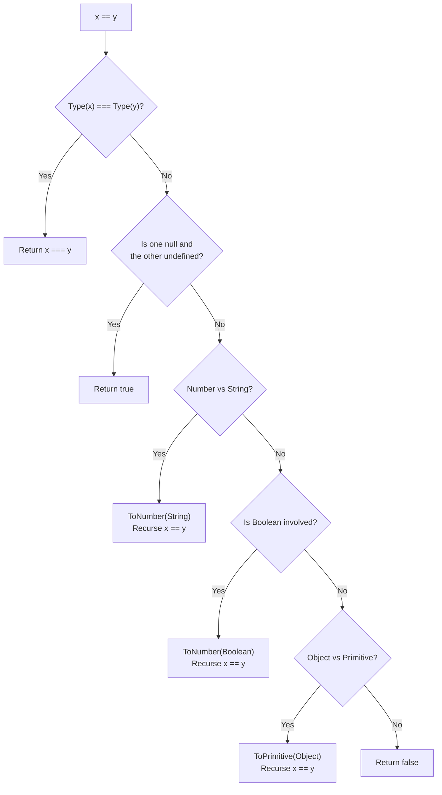

# Abstract Equality vs Strict Equality

## 1. Abstract Equality (`==`)

### Теза
Алгоритм **Abstract Equality Comparison (`==`)** намагається звести операнди різних типів до однакового типу (type coercion) перед тим, як порівняти їх значення за допомогою Strict Equality (`===`).

### Приклад
```javascript
console.log(42 == '42'); // true
console.log(null == undefined); // true
console.log([] == ![]); // true
```

### Просте пояснення
Коли ви використовуєте `==`, JavaScript діє як дуже ввічливий перекладач. Якщо він бачить рядок і число, він каже: "Давайте я перетворю рядок на число, і тоді ми подивимось, чи вони однакові". Він має цілу книгу правил:
- `null` і `undefined` завжди рівні один одному і більше нічому (навіть не `false`).
- Рядки та булеві значення конвертуються в числа.
- Об'єкти намагаються стати примітивами (наприклад, масив `[]` стає пустим рядком `""`, а потім числом `0`).

### Технічне пояснення
Згідно зі специфікацією ECMAScript (ECMA-262), алгоритм *Abstract Equality Comparison* (`x == y`) працює як рекурсивний скінченний автомат:
1. Якщо типи `x` та `y` однакові — алгоритм повертає результат `x === y`.
2. Якщо один з них `null`, а інший `undefined` — результат `true`.
3. Якщо порівнюються `Number` і `String`, рушій виконує `ToNumber()` для рядка і знову викликає `==` рекурсивно.
4. Якщо один з операндів `Boolean`, рушій виконує `ToNumber()` для нього (де `true` стає `1`, а `false` стає `0`), і знову викликає `==` рекурсивно.
5. Якщо один операнд — `Object`, а інший — `String`, `Number` або `Symbol`, рушій викликає `ToPrimitive(Object)` за допомогою внутрішнього методу `[[DefaultValue]]` і знову викликає `==`.

> [!IMPORTANT]
> Рушій V8 намагається максимально оптимізувати `==`, використовуючи **Inline Caches (IC)** на рівні байткоду (Ignition). Але якщо типи операндів під час численних викликів функції постійно змінюються (megamorphic call site), це викликає **deoptimization** (деоптимізацію), і операція порівняння переходить на повільний шлях виконання (slow path) з викликом повних C++ функцій конвертації.

### Візуалізація


> [!TIP]
> **[▶ Запустити інтерактивний симулятор (Abstract Equality: `[] == ![]`)](../../visualisation/type-system/01-abstract-equality/index.html)**
> 
> *Цей візуалізатор покроково імітує поведінку абстрактної рівності на прикладі `[] == ![]` та показує черговість виклику абстрактних операцій рушія.*

### Edge Cases / Підводні камені

#### Парадокс `[] == ![]`
Це класичне питання зі співбесід, яке демонструє каскадну конверсію типів:
1. Спочатку виконується вираз `![]`. Оскільки `[]` є об'єктом, він набуває значення `truthy`. Тому `!truthy` дає `false`. Рівняння стає: `[] == false`.
2. За алгоритмом, якщо один з операндів `Boolean`, він перетворюється на число. `ToNumber(false)` дає `0`. Рівняння стає: `[] == 0`.
3. Тепер маємо `Object` (`[]`) порівняний з `Number` (`0`). Об'єкт має бути приведений до примітива за допомогою `ToPrimitive([])`.
4. Для масиву викликається метод `.toString()`, який склеює елементи масиву в рядок. Пустий масив дає пустий рядок `""`. Рівняння стає: `"" == 0`.
5. Маємо порівняння `String` з `Number`. Рядок перетворюється на число через `ToNumber("")`, що дає `0`.
6. Фінальне порівняння: `0 == 0`, що є `true`.

## 2. Strict Equality (`===`)

### Теза
Алгоритм **Strict Equality Comparison (`===`)** порівнює значення без неявного приведення типів. На рівні двигуна ця операція працює у багато разів швидше і надійніше.

### Приклад
```javascript
console.log(42 === '42'); // false
console.log(null === undefined); // false
console.log({} === {}); // false (різні адреси в Heap)
console.log(+0 === -0); // true
console.log(NaN === NaN); // false
```

### Просте пояснення
Підхід `===` — це клон-охоронець. Він перевіряє паспортні дані: спочатку він дивиться, чи типи у значень однакові. Якщо ні — жодних розмов, одразу повертає брехню (`false`). Якщо типи однакові, він далі дивиться на конкретне значення або адресу об'єкта.

### Технічне пояснення
Звичайна операція `x === y` в двигуні V8 компілюється в одну або кілька низькорівневих асемблерних інструкцій:
1. **Type Check**: Перевіряються типи `Type(x)` та `Type(y)`. Якщо вони відрізняються, одразу повертається `false`.
2. **Numbers & NaN**: Якщо це числа і бодай одне з них `NaN` — повертає `false`. `NaN` в архітектурі IEEE-754 єдиний не дорівнює самому собі.
3. **Primitive Value Match**: Якщо типи `String`, `Boolean`, `Symbol` тощо: перевіряється, чи їхні значення побітово ідентичні.
4. **Reference (Heap) Check**: Для об'єктів перевіряється `Reference` (вказівник на пам'ять). Рушій виконує порівняння адрес, де вони лежать у **Heap**. Виклик ідентифікатора `{}` завжди виділяє нову пам'ять, тому дві порожні фігурні дужки мають різні адреси (`false`).

### Edge Cases / Підводні камені

#### NaN та Object.is()
Згідно зі стандартом `===`, `NaN === NaN` є `false`, і `+0 === -0` є `true`.
Але іноді потрібно абсолютно точне порівняння. Для цього існує `Object.is()`, який відомий як **SameValue** алгоритм у специфікації:
```javascript
// Коли потрібен строгий контроль підводних каменів:
Object.is(NaN, NaN); // true
Object.is(+0, -0); // false
```
`Object.is()` корисний для кешування, мемоїзації в React та інших випадках, де важливо розрізняти `-0` від `+0` або правильно переховувати `NaN`.
