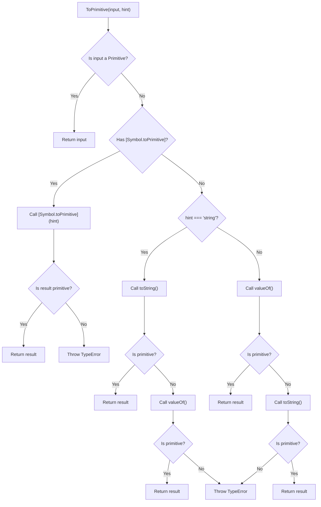

# Primitive Coercion Algorithms

## 1. ToPrimitive Algorithm

### Теза
**`ToPrimitive`** — це абстрактна внутрішня операція JavaScript рушія, яка бере об'єкт і намагається перетворити його у примітивне значення (рядок або число).

### Приклад
```javascript
const obj = {
  valueOf() { return 42; },
  toString() { return "hello"; }
};

console.log(obj + 1); // 43
console.log(`${obj}`); // "hello"
```

### Просте пояснення
Уявіть, що об'єкт — це коробка з інструментами, а ви намагаєтесь її додати до числа або вставити в рядок (template literal). JavaScript не може скласти коробку і число, тому він питає коробку: "У тебе є щось простіше, ніж ти сама?" У коробки є два секретні номери телефонів: `valueOf` і `toString`. Залежно від ситуації (чи хочемо рядок, чи число) JavaScript дзвонить спочатку одному, потім іншому, поки не отримає простий результат.

### Технічне пояснення
Згідно специфікації (ECMA-262), `ToPrimitive` приймає `input` і необов'язковий прапорець `PreferredType` (може бути `number`, `string` або `default`).
1. Якщо `input` вже є примітивом, він повертається без змін.
2. Якщо об'єкт має метод `[Symbol.toPrimitive]`, він викликається першим з підказкою (hint).
3. Якщо підказки немає, і це метод `valueOf()` або `toString()`, рушій V8 намагається їх викликати почергово.
4. Якщо `hint === "string"`: першим викликається `toString()`. Якщо результат не примітив — викликається `valueOf()`.
5. Якщо `hint === "number"` або `"default"`: першим викликається `valueOf()`. Якщо результат не примітив — викликається `toString()`.
6. Якщо жоден з методів не повернув примітив, алгоритм викидає `TypeError: Cannot convert object to primitive value`.

> [!CAUTION]
> Перевизначення `valueOf` або `toString` на рівні прототипів (наприклад `Object.prototype.toString`) ламає весь type coercion в системі V8, спричиняючи масові баги та деоптимізацію (hidden classes (Shapes) стають polymorphic).

### Візуалізація


> [!TIP]
> **[▶ Запустити інтерактивний симулятор (ToPrimitive: `Object` vs `Date`)](../../visualisation/type-system/02-primitive-coercion/index.html)**
> 
> *Цей візуалізатор імітує алгоритмічні відмінності під час виклику `valueOf` та `toString` залежно від типу об'єкта під час конкатенації (`+`).*

### Edge Cases / Підводні камені

#### Дати (Date object)
Усі звичайні об'єкти за налашчуванням мають `hint === "default"`, що розцінюється як `"number"` (першим кличеться `valueOf()`). АЛЕ об'єкти типу `Date` є винятком стандарту. Їх `hint === "default"` вважається `"string"`!
```javascript
const d = new Date();
console.log(d + 1); // Викличе toString(), результат: "Thu May 16 2026 ...1"
console.log(d - 1); // Викличе valueOf() (через мінус), результат: час в мілісекундах - 1, напр. 1778950000000
```
#### Масиви як ключі об'єкта
```javascript
let map = {};
let arr = [1, 2];
map[arr] = 'secret'; // Під капотом масив перетворюється на рядок "1,2"
console.log(map["1,2"]); // 'secret'
```
Це стається, оскільки ключі об'єкта піддаються `ToPrimitive(key, "string")`. Масив викликає свій метод `toString()`, що поєднує елементи через кому.

---

## 2. ToNumber Algorithm

### Теза
Алгоритм **`ToNumber`** намагається математично оцінити значення або рядок. Він набагато строгіший за `parseInt`, оскільки не пробачає сторонніх символів.

### Приклад
```javascript
console.log(+"42"); // 42
console.log(+"42px"); // NaN
console.log(parseInt("42px")); // 42
```

### Просте пояснення
Він як математичний калькулятор. Якщо ви даєте йому `"42"`, він каже: "Добре, це 42". Якщо ви даєте `"42px"`, він скаже "Не зрозумів, це не математика" і видасть `NaN` (Не Число). Він не вибачає помилки.

### Технічне пояснення
У специфікації оператор унарного плюса `+value` викликає алгоритм `ToNumber`.
1. `undefined` -> `NaN`.
2. `null` -> `+0`.
3. `boolean` (`true` -> `1`, `false` -> `+0`).
4. `string` -> Парситься повністю за граматикою чисел. Пробіли з країв ігноруються (`" 42 "` -> `42`), порожній рядок стає `0`. Якщо хоча б один символ всередині не є цифровим (окрім `.`, `e`, `+`, `-`), повертається `NaN`.
5. `object` -> Спочатку виконується `ToPrimitive(value, "number")`, а потім отриманий примітив пропускається крізь оці ж правила `ToNumber`.

> [!TIP]
> Під капотом V8 `ToNumber("") === 0` є спадщиною дизайну мови (design flaw/legacy), яка часто призводить до багів. Тому у сучасних двигунах використовують строгу типізацію на етапі TurboFan (оптимізуючий компілятор), який вимагає явних `Number()` замість `+`.

---

## 3. ToString Algorithm

### Теза
Алгоритм **`ToString`** перетворює будь-яке значення у його лінгвістичне представлення (String). Найчастіше зустрічається при конкатенації (`+`) зі строкою.

### Приклад
```javascript
console.log(String(null)); // "null"
console.log("" + undefined); // "undefined"
console.log([1, null, 3].join(", ")); // "1, , 3"
```

### Просте пояснення
`ToString` просто описує вам значення літерами. Якщо це масив — він склеює елементи через кому. Єдине, що збиває з пантелику: коли ви працюєте з масивами, `null` та `undefined` всередині масиву тишком-нишком перетворюються на порожні рядки, а не на `"null"` чи `"undefined"`.

### Технічне пояснення
1. `undefined` -> `"undefined"`.
2. `null` -> `"null"`.
3. `boolean` -> `"true"` або `"false"`.
4. `number` -> Число форматується як Base-10 рядок. Для дуже великих/малих чисел використовується експоненціальна форма (наприклад, `1e-7`). `NaN` -> `"NaN"`.
5. `object` -> Раунд `ToPrimitive(value, "string")`, потім `ToString` результату.

V8 має окрему `StringTable` в пам'яті (Heap) для збереження рядків. Зайві конвертації через `ToString` у циклах створюють непотрібні дублікати в `StringTable` (string permutation overhead), переповнюючи пам'ять (memory bloat) доки Garbage Collector (GC) їх не змете.

### Edge Cases / Підводні камені

#### Конкатенація `+` vs Шаблонний літерал
Конкатенація об'єкта через бінарний плюс (`var + {}`) спочатку викликає `ToPrimitive` (з `hint === "default"`). Але шаблонний літерал (Template Literal) `` `${}` `` діє інакше: він явно дає підказку `hint === "string"`.
```javascript
const obj2 = {
  valueOf: () => 10,
  toString: () => "ten"
};

console.log(obj2 + "");  // "10" (hint 'default' -> викликався valueOf)
console.log(`${obj2}`);  // "ten" (hint 'string' -> викликався toString)
```
Це критичний нюанс архітектури, яка показує чому Template Literals надійніші при логуванні об'єктів.
